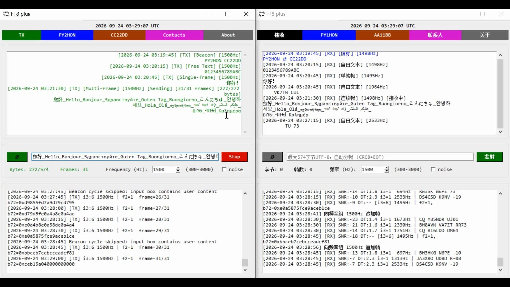

# FT8 Plus 1.0 Protocol Feature Demo

[](LICENSE)
[](https://www.python.org/)
[](https://github.com/BI3BJU/FT8_Plus_Desktop)
[](https://github.com/BI3BJU/FT8_Plus_Desktop)

---

## Screenshots

| Main |
| :---: |
|  |

Copyright (C) 2026 BI3BJU

Based on PyFT8, this program implements the FT8 Plus 1.0 protocol for demonstration purposes.

- Project homepage: https://github.com/BI3BJU/FT8_Plus_Desktop
- Email: guerilla1949@gmail.com

## Capabilities

- Receive standard FT8 messages: i3=1, decode standard callsign, grid, reports.
- Transmit/receive free text: i3=0, n3=0, up to 13 chars, base-42 charset.
- Transmit/receive beacon: i3=0, n3=0, content is "callsign + 6-char Maidenhead grid", every 4 slots (60s).
- Transmit/receive transparent single frame: i3=6, f2=0, up to 9 bytes, no CRC/EOT.
- Transmit/receive transparent continuous frame: i3=6, f2=1, multi-frame, 9-byte chunks, CRC8+EOT, up to 64 frames.
- Callsign strictly 3~6 chars; grid strictly 6-char Maidenhead.
- Auto extract sender callsign from message start, validate and add contact.
- Highlight in orange when own callsign is targeted.
- Auto save config, contacts, history, status.
- NTP time correction, half-duplex.

## Installation

### Prerequisites

- Python 3.8 or newer
- `pip`
- A working audio input/output device
- Optional: Git

> This program does **not** use CAT, PTT, serial port, frequency, or mode control. It only uses the system default audio output device. For VOX operation, enable the optional preamble noise in the GUI.

### 1. Clone the repository

```bash
git clone https://github.com/BI3BJU/FT8_Plus_Desktop.git
cd FT8_Plus_Desktop
```

### 2. Create a virtual environment (recommended)

Windows:

```bat
py -3 -m venv .venv
.venv\Scripts\activate
```

macOS / Linux:

```bash
python3 -m venv .venv
source .venv/bin/activate
```

### 3. Install dependencies

```bash
pip install --upgrade pip
pip install -r requirements.txt
```

`pyaudio` may require the PortAudio system library:

- Debian / Ubuntu:

  ```bash
  sudo apt install portaudio19-dev
  ```

- macOS:

  ```bash
  brew install portaudio
  ```

- Windows: usually installed from a prebuilt wheel. If installation fails, install a compatible `pyaudio` wheel for your Python version.

### 4. Start the program

If `main.py` is in the repository root:

```bash
python main.py
```

If `main.py` is inside the `Python/` directory:

```bash
cd Python
python main.py
```

On first start, configure your callsign, grid, TX frequency, and optional preamble noise in the GUI. The program will create and update the persistent files automatically.

## Quick Start

1. Start the program using one of the commands above.

2. In the GUI, set the required parameters:

   - **Callsign**: 3–6 characters. Format: 1–2 character prefix + 1 digit + 0–3 letters. The prefix must contain at least one letter.
   - **Grid**: 6-character Maidenhead locator, e.g. `PM00aa`. Format: `[A-R]{2}[0-9]{2}[A-X]{2}`.
   - **TX frequency**: 300–3000 Hz, default 1500 Hz, step 6.25 Hz.
   - **Preamble noise**: optional. When enabled, 1 second before the slot is used for VOX control: 0.5 s white noise + 0.5 s silence, then the FT8 audio.

3. Save the configuration. The program will create or update:

   - `config.txt` — callsign, TX frequency, preamble noise, grid
   - `contact.txt` — contacts, one `callsign,note` per line
   - `history.txt` — history, JSON Lines
   - `status.txt` — status log, plain text

4. Choose an operating mode:

   - **Standard FT8**: `i3=1`, standard callsign, grid, and reports.
   - **Free text**: `i3=0`, `n3=0`, up to 13 characters, base-42 charset.
   - **Beacon**: `i3=0`, `n3=0`, content is `callsign + 6-char Maidenhead grid`, transmitted every 4 slots (60 s).
   - **Transparent single frame**: `i3=6`, `f2=0`, up to 9 bytes, no CRC/EOT.
   - **Transparent continuous frame**: `i3=6`, `f2=1`, multi-frame, 9-byte chunks, CRC8+EOT, up to 64 frames.

5. Wait for the 15 s cycle. The program is half-duplex. If preamble noise is enabled, the 1 s noise/silence preamble is sent before the FT8 audio.

6. Incoming messages are decoded, validated, and saved automatically. Messages that target your own callsign are highlighted in orange.

### Optional: Build a Windows executable

`build.bat` uses PyInstaller. Before running it, edit the hard-coded path:

```bat
cd /d C:\FT8_Plus
```

Change it to your local repository path, or replace it with:

```bat
cd /d "%~dp0"
```

Ensure `logo.ico`, `zh_rCN.txt`, and `version.txt` exist in the same directory as `main.py`. Then run:

```bat
build.bat
```

The output executable will be placed at:

```text
dist\FT8_Plus.exe
```

## Radio Control & Audio

- No radio control: no PTT, CAT, serial, freq, mode control; only audio output.
- Optional preamble noise for VOX control: 1s before slot, 0.5s white noise + 0.5s silence, then FT8 audio.
- Uses system default audio devices.

## Fixed Parameters

- Cycle 15s; sample rate 12000 Hz; symbol rate 6.25; HPS=4; BPT=2.
- 0.04s per hop; 0.160s per symbol; 375 hops/cycle; 750 hops/2 cycles.
- TX freq 300~3000 Hz; default 1500 Hz; step 6.25 Hz.
- Max raw data 574 bytes; total 576 bytes; max 64 frames.
- Freq group tolerance +/-10 Hz; merge delay 4 slots (60s).
- Max contacts 100; max history 100; max status messages 100; max note 32 bytes.

## Persistent Files

- config.txt: callsign, TX freq, preamble noise, grid.
- contact.txt: contacts, one "callsign,note" per line.
- history.txt: history, JSON Lines.
- status.txt: status log, plain text.

## Validation Rules

- Callsign: strict 3~6 chars, structure 1~2 prefix + 1 digit + 0~3 letters, prefix has at least one letter.
- Grid: strict 6-char Maidenhead, format [A-R]{2}[0-9]{2}[A-X]{2}.

## License

This program is free software: you can redistribute it and/or modify
it under the terms of the GNU General Public License as published by
the Free Software Foundation, either version 3 of the License, or
(at your option) any later version.

This program is distributed in the hope that it will be useful,
but WITHOUT ANY WARRANTY; without even the implied warranty of
MERCHANTABILITY or FITNESS FOR A PARTICULAR PURPOSE. See the
GNU General Public License for more details.

You should have received a copy of the GNU General Public License
along with this program. If not, see <https://www.gnu.org/licenses/>.

The full license text is provided in the `LICENSE` file in this repository.

SPDX-License-Identifier: GPL-3.0-or-later