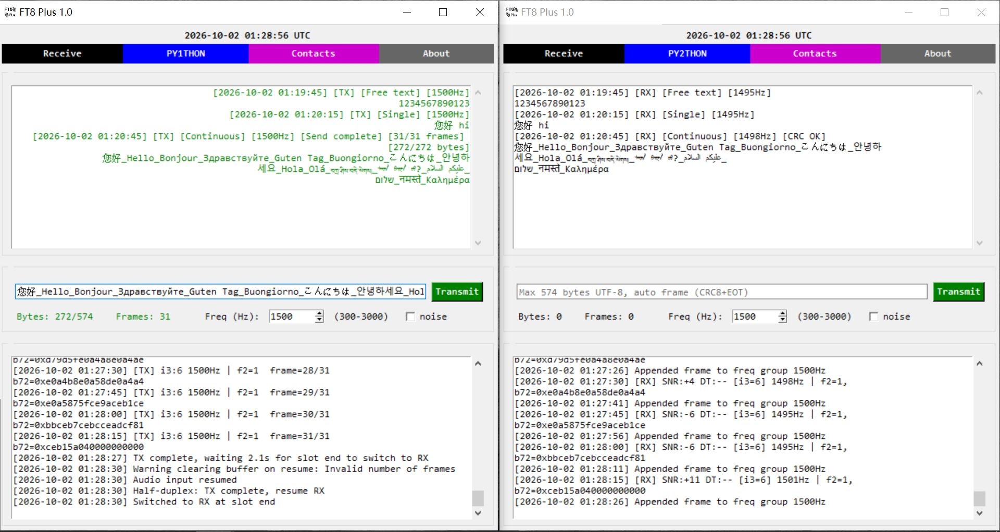

# FT8 Plus 1.0 Protocol Feature Demo

[](LICENSE)
[](https://www.python.org/)
[](https://github.com/BI3BJU/FT8_Plus_Desktop)
[](https://github.com/BI3BJU/FT8_Plus_Desktop)

---

## Screenshots

| Main |
| :---: |
|  |

Copyright (C) 2026 BI3BJU

Based on PyFT8, this program implements the FT8 Plus 1.0 protocol for demonstration purposes.

- Project homepage: https://github.com/BI3BJU/FT8_Plus_Desktop
- Email: guerilla1949@gmail.com

## Capabilities

- Receive standard FT8 messages: i3=1, decode standard callsign, grid, reports.
- Transmit/receive free text: i3=0, n3=0, up to 13 chars, base-42 charset.
- Transmit/receive transparent single frame: i3=6, f2=0, up to 9 bytes, no CRC/EOT.
- Transmit/receive transparent continuous frame: i3=6, f2=1, multi-frame, 9-byte chunks, EOT terminated, up to 64 frames, max 574 bytes of raw data.
- The sender automatically filters out non-printable characters (including `0x04`, control characters, etc.) to avoid conflicts with EOT; `\t`, `\r`, and `\n` are preserved.
- The receiver uses `0x04` as the end-of-continuous-frame marker; after reassembly it verifies CRC8 and strips the `0x20` padding.
- Callsign strictly 3~7 chars.
- Auto extract sender callsign from message start, validate and add contact.
- Highlight in blue when either the sender or the target matches the local callsign.
- Auto save config, contacts, history, status.
- NTP time correction, half-duplex.

## Installation

### Prerequisites

- Python 3.8 or newer
- `pip`
- A working audio input/output device
- Optional: Git

> This program does **not** use CAT, PTT, serial port, frequency, or mode control. It only uses the system default audio output device. For VOX operation, enable the optional preamble noise in the GUI.

### 1. Clone the repository

```bash
git clone https://github.com/BI3BJU/FT8_Plus_Desktop.git
cd FT8_Plus_Desktop